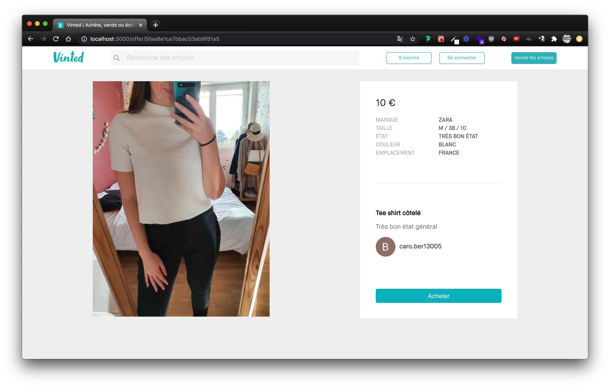
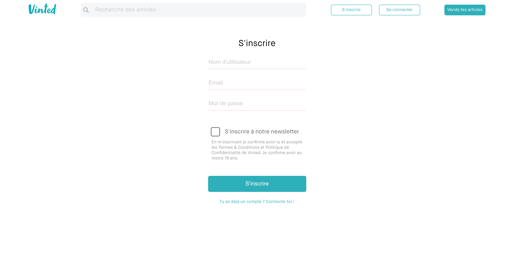
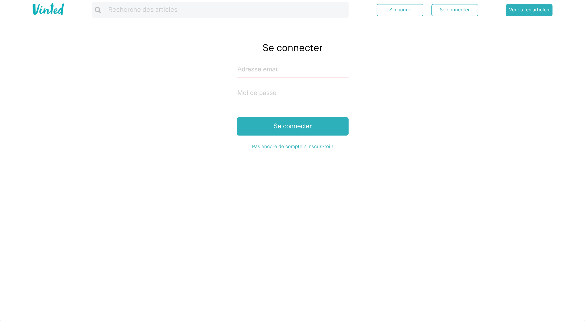
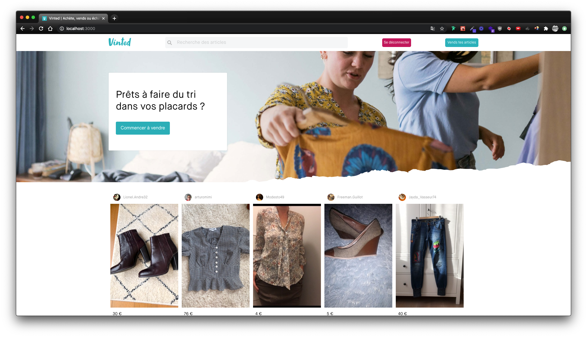

# Vinted

## Home

La page **Home** sera la page d'accueil et affichera la liste des dernières annonces publiées.


### GitHub

Pour ce projet, vous devrez obligatoirement sauvegarder votre code régulièrement sur GitHub.

Le Reacteur décline toute responsabilité en cas de perte de vos fichiers JavaScript. 😇

### Route React

- URL de la page : http://localhost:5173
- Composant : **'src/pages/Home.jsx'**

### API

**Nous vous recommandons d'utiliser en premier lieu l'API fournie par le Reacteur avant de procéder avec l'API que vous avez développée durant le module Backend.** Ceci afin de compartimenter les problèmes pouvant survenir : l'API du Reacteur est garantie fonctionnelle. Commencez donc par utiliser la route fournie ci-dessous. Une fois la page fonctionnelle, vous pouvez tenter d'utiliser votre API développée pendant le module Backend !

- URL : 'ROUTE/offers'
- Méthode HTTP : **'GET'**

### Interactions

- Il sera possible pour l'utilisateur de choisir une annonce pour se rendre sur la page de celle-ci. Vous aurez donc besoin de mettre en place de la navigation grâce à React Router.

- Vous devrez mettre en page la barre de recherche dans le Header mais ne travaillez pas pour le moment sur la recherche en elle-même.

### Recommandation

N'utilisez jamais de **className** ou d'**id** contenant le mot **ad** car la plupart des Ad Blockers considèrent ces balises comme étant des publicités et les masquent automatiquement.

### Par où commencer ?

- Mettez en place React Router
- Créez les pages Home et Offer avec un lien permettant de passer d'une page à l'autre et ainsi tester la navigation
- Créer un composant Header dans lequel figurera le logo et trois boutons (s'inscrire, se connecter et vends tes articles ). Aucune intéraction dans ce composant pour l'instant !
- Réalisez l'intégration HTML (de la page Home dans un premier temps), sans trop de CSS
- N'essayez pas d'intégrer la forme qui permet de donner un effet "déchiré" à l'image du hero
- Créez les états
- Ajoutez les interactions
- Réalisez le CSS

### Bonus

#### Pagination

Permettez à l'utilisateur de parcourir les pages de résultats. L'API possède des paramètres **'skip'** et **'limit'** qui vous seront utiles pour récupérer seulement une partie des annonces de la base de données.

Exemples :

- Pour afficher la première page de résultats : 'ROUTE/offers?page=1&limit=8'
- Pour afficher la deuxième page de résultats : 'ROUTE/offers?page=2&limit=8'
- Pour afficher la troisième page de résultats : 'ROUTE/offers?page=3&limit=8'

Notez que cette route permet aussi de récupérer le nombre d'annonces total dans la propriété count. Cette valeur vous aidera à calculer le nombre de pages maximum.

#### Effet "déchiré" du hero

Récupérez l'image sur https://www.vinted.fr/ puis intégrez-là à votre projet !

## Offer

La page **Offer** affichera le descriptif d'une annonce.



### Route React

URL de la page : http://localhost:5173/offers/:id

Composant : **'src/pages/Offer.jsx'**

### API

Nous vous recommandons d'utiliser l'API que vous avez développée durant le module Backend. Si celle-ci n'est pas opérationnelle, vous pouvez utiliser la route suivante :

- URL : 'ROUTE/offers/:id'
- Méthode HTTP : **'GET'**

Exemple de requête :

'ROUTE/offer/6196659305212ce3cc03e07d'

Exemple de réponse :

```json
{
  product_details: [
    {
      TAILLE: "XS / 34 / 6",
    },
    {
      ÉTAT: "BON ÉTAT",
    },
    {
      COULEUR: "NOIR",
    },
    {
      EMPLACEMENT: "EMMEN, NEDERLAND",
    },
  ],
  product_pictures: [],
  _id: "6196659305212ce3cc03e07d",
  product_name: "Josh V",
  product_description: "Zwarte trui met tekst",
  product_price: 15,
  owner: {
    account: {
      username: "Maybelle_Prevost",
      avatar: {
        asset_id: "1361019ccd485488ef3967719269b81a",
        public_id: "api/vinted/users/619653902db0c60018da13d6/avatar",
        version: 1637241745,
        version_id: "342ec88b8b138698b2dacbefbeb69e50",
        signature: "1f33b74d2cf3e86089be62f2479907c6cbe7050d",
        width: 640,
        height: 480,
        format: "jpg",
        resource_type: "image",
        created_at: "2021-11-18T13:22:25Z",
        tags: [],
        bytes: 118828,
        type: "upload",
        etag: "b822fce1af35948c6664a214c966637f",
        placeholder: false,
        url: "http://res.cloudinary.com/lereacteur/image/upload/v1637241745/api/vinted/users/619653902db0c60018da13d6/avatar.jpg",
        secure_url:
          "https://res.cloudinary.com/lereacteur/image/upload/v1637241745/api/vinted/users/619653902db0c60018da13d6/avatar.jpg",
        access_mode: "public",
        original_filename: "abstract",
        api_key: "361833749344571",
      },
    },
    _id: "619653902db0c60018da13d6",
  },
  product_image: {
    asset_id: "9bb504cd6975bfe3f2ce0b0ad7234c47",
    public_id: "api/vinted/offers/6196659305212ce3cc03e07d/preview",
    version: 1637246356,
    version_id: "935c3e1465cb43a6008d86ad0f57c60d",
    signature: "3c0fc98e3dc34321d330899646a20e5745f91349",
    width: 310,
    height: 430,
    format: "jpg",
    resource_type: "image",
    created_at: "2021-11-18T14:39:16Z",
    tags: [],
    bytes: 35517,
    type: "upload",
    etag: "e332088e8c58d9055dd0503eb9f9bf4c",
    placeholder: false,
    url: "http://res.cloudinary.com/lereacteur/image/upload/v1637246356/api/vinted/offers/6196659305212ce3cc03e07d/preview.jpg",
    secure_url:
      "https://res.cloudinary.com/lereacteur/image/upload/v1637246356/api/vinted/offers/6196659305212ce3cc03e07d/preview.jpg",
    access_mode: "public",
    original_filename: "preview",
    api_key: "361833749344571",
  },
  product_date: "2021-11-18T14:39:15.235Z",
  __v: 0,
};
```

### BONUS

Si vos annonces possèdent plusieurs images, implémentez **'react-multi-carousel'** pour implémenter un carousel d'images.

Si vous le souhaitez, vous pouvez utiliser l'API Vinted du Reacteur pour cela : 'ROUTE'

## Signup



<br>

La page "Sign Up" permettra à un utilisateur d'entrer son pseudo, son email et son mot de passe pour se créer un compte.

### Route React

- URL de la page : http://localhost:5173/signup
- Composant : **'src/pages/Signup.jsx'**

### API

Lorsque l'utilisateur cliquera sur "S'inscrire", vous devrez appeler l'API qui se trouve à l'adresse suivante (ou votre propre API) :

- URL : 'ROUTE/user/signup'
- Méthode HTTP : **'POST'**

Exemple de requête :

```json
{
  "email": "johndoe@lereacteur.io",
  "username": "JohnDoe",
  "password": "azerty",
  "newsletter": true
}
```

Si les informations entrées sont valides, le serveur retournera, entre autres, le **'token'**. Ce token devra être sauvegardé dans les cookies pour une utilisation ultérieure.

### Git

Pensez à push votre code régulièrement sur GitHub

```$
git status # Affiche les fichiers modifiés
git add . # Ajoute tous les fichiers modifiés à votre prochain commit
git commit -m "Description de votre modification (en anglais)" # Crée une sauvegarde locale des modifications de vos fichiers
git push # Sauvegarde votre commit sur le serveur distant
```

### Bonus

Déclencher l'affichage d'une modal lorsque l'utilisateur clique sur le bouton **'S'inscrire'** du header (et non une nouvelle page).

## Login



<br>

Le but de cet exercice est d'afficher une page "Log In" lorsque l'utilisateur cliquera sur le bouton "Se connecter". Dans cette page, l'utilisateur pourra entrer son email et son mot de passe afin de s'authentifier ou alors rejoindre la page "Créer un compte".

### Route React

- URL de la page : http://localhost:5173/login
- Composant : **'src/pages/Login.jsx'**

### API

Le formulaire "Log In" devra appeler la route suivante (ou votre propre API) :

- URL : 'ROUTE/user/login'
- Méthode HTTP : **'POST'**

Exemple de requête :

```json
{
  "email": "johndoe@lereacteur.io",
  "password": "azerty"
}
```

Si l'email et le mot de passe sont valides, le serveur retournera, entre autres, le **'token'**. Ce token devra être sauvegardé dans les cookies pour une utilisation ultérieure.

### Déconnexion

Une fois connecté, l'utilisateur pourra cliquer sur "Se déconnecter". Cette action entraînera la suppression du cookie **'token'** ainsi que le retour à l'état "non-connecté".



### Git

Pensez à push votre code régulièrement sur GitHub

```$
git status # Affiche les fichiers modifiés
git add . # Ajoute tous les fichiers modifiés à votre prochain commit
git commit -m "Description de votre modification (en anglais)" # Crée une sauvegarde locale des modifications de vos fichiers
git push # Sauvegarde votre commit sur le serveur distant
```

### Bonus

Déclencher l'affichage d'une modal lorsque l'utilisateur clique sur le bouton **'Se connecter'** du header (et non une nouvelle page)

## Filter

L'idée c'est de réaliser la partie **filtres** du Header.


<br>

Vous pouvez vous inspirer de l'exemple ici : https://lereacteur-vinted.netlify.app/

### API

- URL : 'ROUTE/offers'
- Méthode HTTP : **'GET'**
- Paramètres Query :
  - title : **'String'**
  - priceMin : **'Number'**
  - priceMax : **'Number'**
  - sort : Valeurs possibles **"price-desc"**, **"price-asc"**
  - page : **'Number'**
  - limit : **'Number'**

### Exemples

- Pour chercher le titre **'zara'** : 'ROUTE/offers?title=zara'

- Pour chercher le titre **'zara'** et un prix max de **'200'** : 'ROUTE/offers?title=zara&priceMax=15'

- Pour chercher un prix compris entre **'40'** et **'200'** : 'ROUTE/offers?priceMin=40&priceMax=200'

- Pour trier par prix décroissant : 'ROUTE/offers?sort=price-desc'

- Pour trier par prix croissant : 'ROUTE/offers?sort=price-asc'

- Pour chercher zara et trier par prix croissant en même temps : 'ROUTE/offers?sort=price-asc&title=zara'

### Bonus

#### Price Range

Pour le slider définissant **'priceMin'** et **'priceMax'** vous pouvez utiliser le package [react-range](https://www.npmjs.com/package/react-range).

Il en existe d'autres, n'hésitez pas à les tester !
